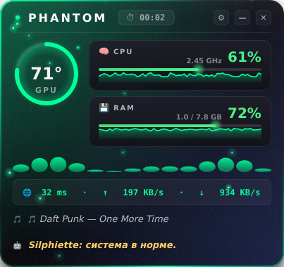

# 👻 Phantom Overlay 4.1 — Polished Edition

**Phantom Overlay** — это современный, лёгкий и полностью настраиваемый внутриигровой оверлей для Windows. Написан на Python + PyQt6 и оформлен в стиле **Glassmorphism** (эффект матового стекла с мягкой тенью).

Программа выводит критически важную информацию о системе поверх любых окон, содержит встроенного AI-ассистента и умеет автоматически скрываться, когда вы не в игре.


---

## ✨ Что нового в 4.1 «Polished Edition»

- 🎨 **Новый визуал** — кастомные градиентные прогресс-бары и мини-графики (sparklines) для CPU / RAM / GPU.
- 🟢 **Динамическая статус-точка** в заголовке — зелёная в норме, жёлтая/красная при перегрузке.
- 🎛️ **Настраиваемый акцентный цвет** — выбирайте любой, не только дефолтный `#00ff99`.
- 🎮 **Редактируемый список игр** для Smart Focus прямо в настройках.
- ⏱️ **Аптайм** в заголовке оверлея.
- 🌐 **Скорость сети** (↑/↓ KB/s) в реальном времени.
- 🪟 **Drop-shadow** вокруг панели.
- ⚙️ **Настраиваемый интервал обновления** (250–5000 мс).
- 🧼 **Чистая остановка потоков** при выходе, логирование ошибок, `requirements.txt`, LICENSE.

---

## 📊 Возможности

### Продвинутый мониторинг
* **Hardware:** температура и загрузка GPU (NVIDIA), использование CPU и RAM в реальном времени — с цветовыми градиентными прогресс-барами и мини-графиками истории.
* **Network:** пинг до `8.8.8.8` + скорость вверх / вниз.
* **AI-ассистент Silphiette:** умный текстовый статус («перегрев GPU», «CPU на 100%», «высокий пинг», «система в норме») + голосовое предупреждение о перегреве видеокарты (> 82 °C).

### Игровая интеграция
* **Smart Focus:** оверлей показывается только когда активное окно содержит название одной из ваших игр (список редактируется в настройках).
* **Discord Rich Presence:** трансляция температуры GPU и текущего трека.
* **Медиа через Windows SDK:** текущий трек + управление Play/Pause/Next/Prev из системного трея.

### Кастомизация
* 4 вкладки в Control Center: **Общие**, **Дизайн**, **Игры**, **О программе**.
* Выбор акцентного цвета (palette picker).
* Прозрачность, фоновая картинка, compact mode.
* Настраиваемый хоткей показа/скрытия.
* Авто-замена иконки трея при наличии `icon.png` рядом с .exe.

---

## 🚀 Запуск (для пользователей)

Если вы просто хотите использовать оверлей в игре, ставить Python и лезть в код не нужно.

1. Перейдите в раздел **[Releases](../../releases)**.
2. Скачайте последнюю версию файла `PhantomOverlay.exe`.
3. Положите его в удобную папку (например, `C:\Phantom`).
4. *(Опционально)* положите рядом `icon.png` — он станет иконкой в трее.
5. Запустите `PhantomOverlay.exe`. Оверлей плавно появится, в трее возникнет значок призрака.

---

## ⚙️ Управление

Управление — через **системный трей** или хоткеем.

* **Правый клик по значку в трее:**
  * `🛠 Режим перетаскивания` — разблокировать окно и передвинуть его.
  * `👁 Скрыть / показать` — переключить видимость оверлея.
  * `⏯ / ⏭ / ⏮ Медиа` — управление музыкой прямо из трея.
  * `⚙ Настройки` — открыть Phantom Control Center.
* **Двойной клик по значку в трее** — быстро скрыть/показать оверлей.
* **Глобальный хоткей:** по умолчанию `Ctrl + Shift + P` — плавное скрытие/показ. Настраивается.

Все настройки сохраняются автоматически в `phantom_config.json` в папке с программой.

---

## 🛠 Сборка из исходников (для разработчиков)

1. **Клон репозитория:**
   ```bash
   git clone https://github.com/iq28qi/Phantom-Overlay.git
   cd Phantom-Overlay
   ```

2. **Виртуальное окружение:**
   ```bash
   python -m venv venv
   venv\Scripts\activate
   ```

3. **Установка зависимостей:**
   ```bash
   pip install -r requirements.txt
   ```

4. **Запуск из исходников:**
   ```bash
   python phantom.py
   ```

5. **Сборка .EXE (Windows):** просто запустите `build.bat` — он поставит зависимости, PyInstaller и соберёт `dist\PhantomOverlay.exe`.

### Зависимости

Смотрите полный список в [`requirements.txt`](requirements.txt). Ключевые: `PyQt6`, `psutil`, `ping3`, `pypresence`, `pygetwindow`, `pyttsx3`, `keyboard`, `nvidia-ml-py`, `winsdk` (Windows-only).

> ⚠️ Библиотека `keyboard` для глобальных хоткеев на Windows требует запуска от администратора.

---

## 🧪 Скриншот

Оверлей выглядит компактно и информативно — градиентные прогресс-бары с мини-графиками, цветовая индикация перегрузки, аптайм и сеть:



---

## 📄 Лицензия

[MIT](LICENSE) © 2025 iq28qi